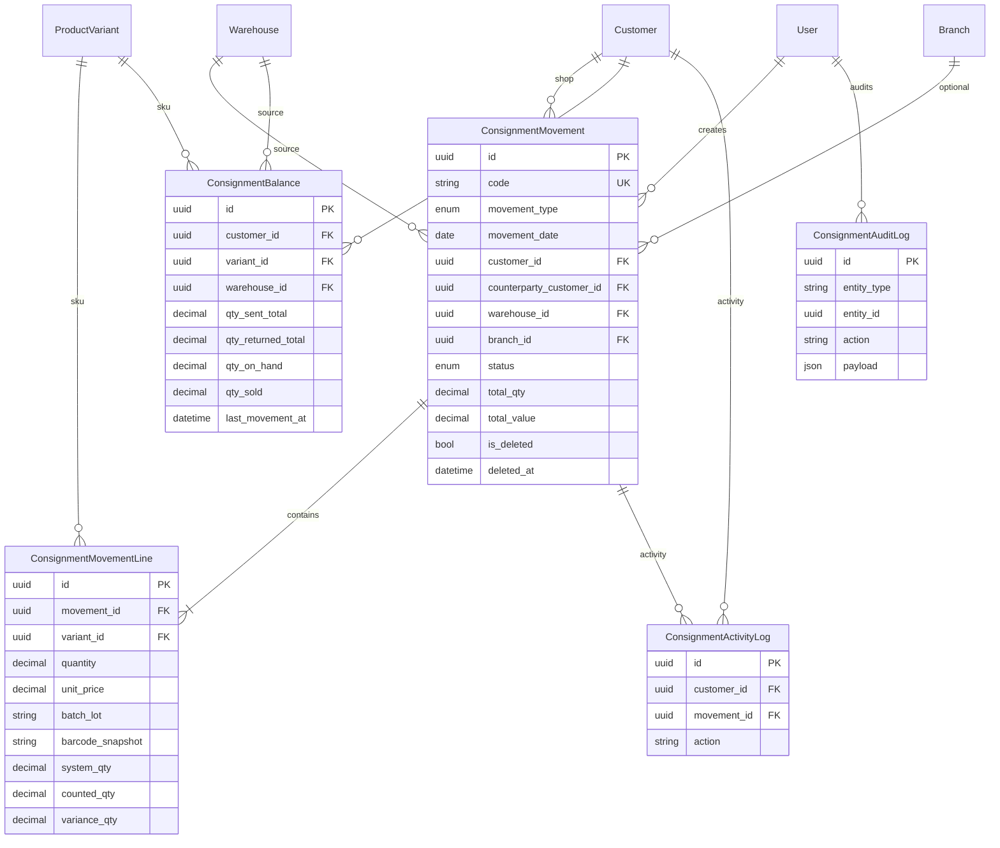

# أمانات المحلات — ERD & Database Schema

## المعادلة الأساسية (Real-time)

```
المبيعات الفعلية (qty_sold) = qty_sent_total − qty_on_hand − qty_returned_total
```

تُحدَّث تلقائياً عند اعتماد كل حركة على جدول `ConsignmentBalance`.

---

## ERD (Mermaid)



---

## أنواع الحركات

| النوع | الكود | التأثير على الرصيد |
|--------|------|---------------------|
| إرسال أمانة | `send` | +sent, +on_hand, −مخزن المكتب |
| مرتجع أمانة | `return` | +returned, −on_hand, +مخزن المكتب |
| تحويل أمانة | `transfer` | −on_hand محل أ، +on_hand محل ب |
| جرد أمانة | `count` | ضبط on_hand = counted، إعادة sold |
| تسوية عجز/زيادة | `settlement` | تعديل on_hand حسب variance |

---

## فهرسة (Indexing)

- `ConsignmentMovement`: `(customer, movement_type, status)`, `(movement_date, status)`, `code`
- `ConsignmentBalance`: `(customer, qty_on_hand)`, `variant`, unique `(customer, variant, warehouse)`
- `ConsignmentMovementLine`: `(movement, variant)`
- `ConsignmentAuditLog`: `(entity_type, entity_id)`, `created_at`

---

## قيود (Constraints)

- `ConsignmentBalance`: UNIQUE (customer, variant, warehouse)
- `ConsignmentMovementLine`: FK CASCADE على الحركة
- `qty_on_hand >= 0` عند الاعتماد (ValidationError)
- Soft delete: `is_deleted` على الحركات فقط — الأرصدة والتدقيق لا تُحذف

---

## API Endpoints

| Method | Path |
|--------|------|
| GET | `/inventory/consignment/dashboard/` |
| GET/POST | `/inventory/consignment/movements/` |
| GET/DELETE | `/inventory/consignment/movements/{id}/` |
| POST | `/inventory/consignment/movements/{id}/approve/` |
| POST | `/inventory/consignment/movements/{id}/cancel/` |
| GET | `/inventory/consignment/customers/{id}/balance/` |
| GET | `/inventory/consignment/customers/{id}/realtime-sales/` |

---

## تقارير مرتبطة (خارطة الطريق)

- كشف حساب عميل / حركة العميل → `customer_balance` + `movements?customer=`
- تقرير أمانات → Dashboard + Aging by shop
- ربط التحصيل والمتأخرين → وحدة `receivables` الحالية
